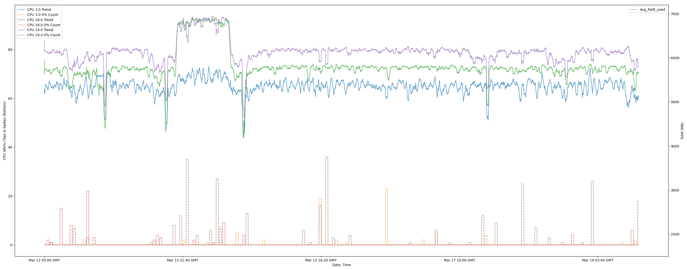

# mpstat_log README

*Built by cldeitzler, 3/2025. Use, edit, and modify as needed with proper crediting. Last Edit: 4/13/2025*

This script combo allows you to monitor and log CPU usage, and then process and visualize it using MatPlot. 
From the user perspective, you'll need to make a few edits to the code depending on your system. I hope to later add a 
version that allows you to use a YAML or ini config file. You will need to make the following changes.
## mpstat_log.sh Edits
- ```INTERVAL=5``` This can be changed to whatever interval you want to log. This is set in seconds
- ```CORES="3,18,19"``` This needs to be changed to match the cores you're monitoring. Arrays start at 0!!
- ```MAX_SIZE=$((1024 * 1024 * 1024))``` This can be changed based on the size you want your file to be. Default here is
1GB 

## mpstat_df.2.x.py Edits
NOTE: This is an active file with many updates and changes most likely not listed. I'll do my best to keep this README
updated accordingly.
- ```filename = 'enterfilenamehere.log'``` Enter the name of the log file created by mpstat_log.sh
- ```start_range = 123``` and `end_range = 123`. Read the code comments, but adjust this if hardcoding a specified
time range. Must be in epoch. NOTE: There's two instances of this... change the second one
- ```rolling_window = max(1, len(df1) // 500)``` You can adjust the granularity here by adjusting the denominator `500`.
Play around with it to find what works best. `500` seems to be good for about 1 week's worth of data, but I've had good
luck with 800 for 3 weeks worth. 
- ```ax1.xaxis.set_major_locator(plt.MaxNLocator(12))``` Edit how many ticks show up. Just make sure 
`...set_minor_locator...` is a factor or reciprocal of this value. 
- There is a section contained that will plot RAM usage. mpstat_log.sh will capture it, but for my current use case,
I do not use it. I've kept the code in here though. You'll need to uncomment that section as well as an additional line:
  - `#df1["Avg_RAM_used"] = df1.groupby("Datetime")["MB_Used"].transform("mean")`
  - `# Uncomment Below to enable RAM tracking`
- If enabling RAM usage, adjust the following:
  - `ax2.set_ylim(1500, 7200)`, where `1500` is min, `7200` is max in MB
  - `df1["Idle%Spikes"] = (df1["Idle%Spikes"] / rolling_window) * 100` adjust `100` for granularity

## Using mpstat_log.sh and mpstat_df.2.x.py
After editing the code/config to match your needs, run the bash script on your server. 
1) Ensure you have the proper permissions. Maybe sudo, maybe not. You'll know best. 
2) Usage: `bash mpstat_log.sh /foo/bar`
3) Two files will be generated: `foo/bar/mpstat_log_01011970).log` and `/foo/bar/mpstat_err.log`
   4) NOTE: The actual writing of errors to `mpstat_err.log` is untested. Might not want to rely on this functionality. 
5) You'll get echos of confirmation if this operation succeeded. You'll also get the PID of this script. 

Now that the .sh is running, let it go collect data. While that's going, you can set up Python and make the edits.
1) If you don't already, download Python. This was built on the versions below. May or may not work on other versions.
   - Python `3.12`
   - Pandas `2.2.3`
   - MatPlotLib `3.10.1`
2) Make the edits that you need to make
3) Download the log file generated by mpstat_log.sh. You'll need to edit it (I hope to change this so you don't have to
do the following steps):
   1) Remove the first 3 lines:
      1) ```0 01 January 1970 GMT Linux 3.14.15-92.6.5cpx86 01/01/1970 _x86_64_ (32 CPU) | 6882 M used, 112783 M free```
      2) ```0 01 January 1970 GMT  | 6882 M used, 112783 M free```
      3) ```0 01 January 1970 GMT 00:00:00 CPU %usr %nice %sys %iowait %irq %soft %steal %guest %gnice %idle ...```
   4) Due to reasons I am unsure, mpstat will periodically rewrite line 3 above. You have to remove all of instances
      1) Search through your .log file using Notepad or grep, searching for `CPU`. Delete all these lines. 
      2) NOTE: I will change this to make the code iterate/skip these lines. Eventually...
3) Enter the name of the file in `filename =` if you haven't already
4) Enter hardcoded times if you haven't already
5) Run the program. Depending on your data and system, this may take a while (1-10 minutes)

## Reading the data
You will get a data output akin to the following: \
 \
NOTE: I'm not a data scientist, so if you know better ways to present data, please edit the code...
1) The top plot is showing averaged CPU Idle percent. The top of the chart is 100% idle (No CPU load).
   - NOTE: The accuracy/granularity of this is impacted by `rolling_window = max(1, len(df1) // 500)`
2) The bottom plot is showing spikes where the CPU hit 0% idle (Full CPU load). The taller the spike, the more
datapoints within the rolling window that are 0% idle. There's no numbers assigned to this value. Just look at it to
determine where spikes occur
3) RAM will plot against the right-sided y-axis. This image doesn't show a line, but it will be generated. 
